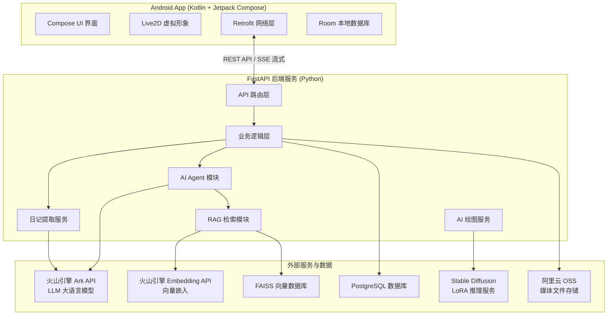

# 心语 - 智能日记系统 设计文档

**作品名称**：心语（Smart Diary）  
**所在赛道与赛项**：A-ST（软件测试与开发）

---

## 一、目标问题与意义价值

### 1.1 应用领域

心语是一款基于人工智能的智能日记应用，面向需要进行日常情绪记录、自我反思与成长的用户群体。系统以 Android 移动应用为主体，配合 Python FastAPI 后端服务，提供日记撰写、AI 辅助分析、情绪追踪、AI 对话交互、AI 绘图等一体化功能。

### 1.2 解决的问题

传统的日记应用仅提供文字记录功能，存在以下痛点：

- **信息碎片化**：日记内容缺乏结构化整理，用户难以快速回顾和发现规律
- **情绪管理缺失**：缺少对情绪变化的追踪与分析工具
- **创作动力不足**：纯文字记录方式单一，用户持续使用率低
- **检索困难**：随着日记数量增长，关键词检索效率低下

心语系统通过以下方式解决上述问题：

| 问题 | 解决方案 |
|------|---------|
| 信息碎片化 | LLM 自动生成结构化摘要、关键词、话题分类 |
| 情绪管理缺失 | 8 维度情绪分析、高光时刻/小确幸标记、情绪曲线追踪 |
| 创作动力不足 | AI Agent 对话式交互、Live2D 虚拟形象陪伴、AI 绘图生成配图 |
| 检索困难 | FAISS 向量检索 + RAG 上下文关联检索，支持自然语言查询日记 |

### 1.3 目标与基本功能

系统实现以下核心功能：

1. **日记管理**：创建、编辑、删除日记，支持按日期查看日历视图
2. **多媒体支持**：文字、图片、音频、视频多种媒体形式
3. **语音输入**：录音转文字，降低输入门槛
4. **AI 结构化提取**：自动生成摘要、关键词、情绪分析、高光时刻
5. **AI 对话助手**：基于日记上下文的智能对话，支持工具调用（创建日记、搜索日记、创建待办等）
6. **情绪追踪**：多维度情绪记录与周期性分析
7. **AI 绘图**：用户上传风格图片，训练 LoRA 模型，生成日记配图
8. **Live2D 虚拟形象**：AI 助手可视化交互，提供情感陪伴
9. **待办事项管理**：与日记关联的任务管理
10. **白噪音与专注计时**：辅助用户记录专注与放松时光

### 1.4 理论意义与应用价值

**理论意义**：
- 探索了大语言模型（LLM）在个人日记场景下的结构化信息提取应用
- 实践了 RAG（检索增强生成）技术在私有日记数据上的检索增强方案
- 验证了 AI Agent（工具调用型代理）在移动应用中的端云协同交互模式

**应用价值**：
- 帮助用户建立持续记录习惯，提升自我认知与情绪管理能力
- 通过 AI 技术降低日记记录的心理门槛（语音输入、AI 辅助撰写）
- 为心理健康辅助工具提供技术参考

---

## 二、设计思路与方案

### 2.1 总体架构设计

心语系统采用**前后端分离 + AI 增强**的架构模式，分为三个主要子系统：



### 2.2 技术路线

| 层次 | 技术选型 | 说明 |
|------|---------|------|
| **移动端** | Kotlin + Jetpack Compose | 现代声明式 UI，跨平台潜力 |
| **移动端架构** | MVVM + Hilt DI | 依赖注入、生命周期管理 |
| **移动端网络** | Retrofit 2 + OkHttp | RESTful API + SSE 流式响应 |
| **移动端本地存储** | Room 数据库 | SQLite ORM，缓存日记数据 |
| **后端框架** | FastAPI (Python 3.x) | 高性能异步 API 框架 |
| **数据库** | PostgreSQL + SQLAlchemy | 关系型数据存储，支持 JSONB |
| **异步任务** | Celery + Redis | 后台提取任务队列 |
| **LLM 服务** | 火山引擎 Ark API | 豆包/Seed 系列大语言模型 |
| **向量检索** | FAISS | Facebook 开源向量索引库 |
| **图像生成** | Stable Diffusion v1.5 + Diffusers | 开源文生图模型 |
| **模型微调** | PEFT (LoRA) | 低秩适配器，风格定制 |
| **服务器** | Uvicorn | ASGI 异步服务器 |

### 2.3 详细设计方案

#### 2.3.1 日记数据模型设计

系统设计了 26 张数据库表，核心表结构如下：

**用户表（users）**：存储用户基本信息（用户名、密码哈希、个人资料）

**日记表（diaries）**：日记主表，包含：
- 基础字段：id、user_id、title、content、diary_date
- 元数据：weather、location、mood_score、mood_type
- 标记字段：is_private、is_highlight、is_little_joy
- **提取状态字段**：extraction_status、content_hash（SHA256）、extract_version
- **向量化状态**：embedding_status

**日记摘要表（diary_summaries）**：存储 LLM 提取结果
- 摘要与关键词：summary、keywords（TEXT[]）、main_topics
- **情绪分析**：primary_emotion、emotion_score、emotion_intensity、emotion_distribution（JSONB）
- **高光/小确幸**：has_highlight、highlight_summary、has_small_happiness、small_happiness_content
- 人物/地点：people_mentioned（JSONB）、places_mentioned（JSONB）

**日记媒体表（diary_media）**：日记内容块，支持 text/image/audio/video 四种类型

**提取任务表（extraction_jobs）**：追踪每次提取任务的执行状态、重试次数、执行时间

**待办表（todos）**：与日记关联的待办事项

**聊天代理计划表（chat_agent_plans）**：存储 AI Agent 待确认的操作计划

#### 2.3.2 AI Agent 工具调用设计

Agent 模块采用**流式输出 + 工具调用 + 用户确认**的交互模式：

**工具类型**：

| 工具名称 | 类型 | 需要确认 | 功能 |
|---------|------|---------|------|
| create_diary | operation | 是 | 创建日记 |
| update_diary | operation | 是 | 编辑日记 |
| create_todo | operation | 是 | 创建待办 |
| search_diaries | read_only | 否 | 搜索日记 |
| get_recent_summaries | read_only | 否 | 获取最近摘要 |
| open_white_noise | client_action | 否 | 打开白噪音（客户端动作） |
| open_test_hub | client_action | 否 | 打开测试中心（客户端动作） |
| open_drawing | client_action | 否 | 打开绘图页面（客户端动作） |
| open_diary_editor | client_action | 否 | 打开日记编辑（客户端动作） |

**交互流程**：
1. 用户发送消息 → 后端流式返回 AI 回复
2. 若 AI 需要执行操作 → 返回 `tool_plan` 事件（待确认计划）
3. 客户端展示操作预览 → 用户确认或取消
4. 确认后 → 后端执行工具 → 返回结果 → AI 生成后续回复

#### 2.3.3 RAG 检索增强设计

RAG 模块采用**双路召回 + 重排序**策略：

1. **向量检索**：使用火山引擎 Embedding API 将文本转为向量，在 FAISS 索引中检索相似片段
2. **关键词检索**：提取中英文关键词，进行 BM25 风格匹配
3. **重排序与去重**：合并两路结果，按相关度评分排序，去除重复内容

知识库文档自动从 `knowledge_base/` 等目录加载，支持 txt、json、md 等格式。

#### 2.3.4 日记提取服务设计

日记提取服务采用**异步任务 + 幂等性检查 + 错误重试**机制：

**流程**：
1. 用户创建/更新日记 → 自动触发提取任务（异步，不阻塞主流程）
2. **幂等性检查**：计算日记内容 SHA256 哈希，与上次比对，相同则跳过
3. **LLM 提取**：调用火山引擎 Ark API，传入日记内容，返回结构化 JSON
4. **Schema 验证**：使用 Pydantic 严格校验 LLM 输出，失败则触发修复流程
5. **结果存储**：存入 diary_summaries 表，同时更新日记的提取状态

**情绪分析维度**：
- 主要情绪（8 种）：开心、平静、焦虑、愤怒、低落、兴奋、复杂、中性
- 情绪评分（1-100）：与情绪类型一致性校验
- 情绪强度：轻微、中等、强烈
- 情绪分布：各情绪类型占比（总和为 1.0）

#### 2.3.5 Stable Diffusion LoRA 微调设计

用户可上传 5-20 张风格图片，系统自动训练个性化 LoRA 模型：

**训练流程**：
1. 用户上传图片 → 后端保存至训练数据目录
2. 调用 `train_lora.py` 脚本，使用 SD v1.5 + PEFT 进行 LoRA 微调
3. 训练完成后，生成 LoRA 权重文件
4. 用户输入日记内容/关键词 → 调用 SD 推理生成配图

**LoRA 配置参数**：
- 秩（rank）：4-8（可配置）
- 学习率：1e-4
- 训练轮数：可配置
- 目标模块：UNet 的注意力层

---

## 三、方案实现

### 3.1 Android 应用实现

#### 3.1.1 项目结构

```
app/
├── src/main/java/com/example/mydiary/
│   ├── MainActivity.kt           # 主活动，Compose UI 入口
│   ├── DiaryApplication.kt       # Hilt 依赖注入配置
│   ├── data/
│   │   ├── models/               # 数据模型（DiaryModels, ChatModels, TestModels 等）
│   │   ├── network/              # Retrofit API 服务、OkHttp 客户端
│   │   ├── repository/           # 数据仓库（DiaryRepository, DrawingRepository 等）
│   │   └── local/                # 本地存储（Room、ChatHistoryStorage）
│   ├── ui/
│   │   ├── calendar/             # 日历视图
│   │   ├── chat/                 # AI 对话界面（支持流式 SSE）
│   │   ├── editor/                # 日记编辑器
│   │   ├── drawing/               # AI 绘图界面
│   │   ├── live2d/                # Live2D 虚拟形象
│   │   ├── test/                  # 心理测试
│   │   ├── todo/                  # 待办事项
│   │   ├── achievement/           # 成就系统
│   │   ├── timer/                 # 专注计时器
│   │   └── profile/               # 个人中心
│   ├── navigation/               # Navigation Compose 导航图
│   ├── live2d/                   # Live2D SDK 封装
│   └── whitenoise/               # 白噪音播放器
└── src/main/res/                  # 资源文件
```

#### 3.1.2 核心界面实现

**日历视图（CalendarScreen）**：
- 月份日历网格，显示有日记的日期（圆点标记）
- 底部日记列表，展示当天日记预览
- FAB 悬浮按钮，快捷创建日记/待办

**AI 对话界面（ChatScreen）**：
- 流式文本输出（打字机效果）
- 图片上传支持（最多 3 张）
- 语音输入（录音 → 后端转写）
- **待确认工具计划卡片**：展示 AI 建议的操作，用户可确认或编辑参数
- **客户端动作处理**：接收 Agent 的 `client_action` 事件，自动跳转页面

**日记编辑器（DiaryEditorScreen）**：
- 富文本输入框，支持标题和正文
- 情绪选择器（滑动评分 + 情绪类型选择）
- 天气/位置标签
- 图片/语音附件
- 保存后自动触发后端提取任务

#### 3.1.3 Live2D 虚拟形象

系统集成了 Live2D Cubism SDK for Java，在 Android 端实现了：
- 两个虚拟角色：Ava 和 Diana
- 动态表情切换（idle、happy、sad 等）
- 与 AI 对话联动的表情反应

### 3.2 后端服务实现

#### 3.2.1 项目结构

```
backend/
├── app/
│   ├── main.py                    # FastAPI 应用入口
│   ├── config.py                  # 环境变量配置
│   ├── celery_app.py             # Celery 异步任务配置
│   ├── routers/                   # API 路由
│   │   ├── diaries.py             # 日记 CRUD + 提取接口
│   │   ├── chat.py                # AI 对话流式接口
│   │   ├── media.py               # 媒体上传
│   │   ├── voice.py               # 语音转文字
│   │   ├── todos.py               # 待办事项
│   │   └── diary_search.py        # 日记搜索
│   ├── services/                  # 业务逻辑层
│   │   ├── diary_service.py       # 日记服务（CRUD、幂等性触发）
│   │   ├── extraction_service.py  # 提取服务（LLM 调用、Schema 验证）
│   │   ├── diary_embedding_service.py  # 向量化服务
│   │   ├── rag/                   # RAG 检索模块
│   │   │   ├── retriever.py       # 检索器（向量+关键词双路召回）
│   │   │   ├── embedding_service.py
│   │   │   ├── faiss_store.py
│   │   │   ├── document_loader.py
│   │   │   └── keyword_extractor.py
│   │   └── drawing/               # AI 绘图服务
│   ├── agent/                     # AI Agent 模块
│   │   ├── tools.py               # 工具注册与执行
│   │   └── plan_store.py          # 待确认计划存储
│   └── models/                    # 数据模型
│       ├── database.py            # SQLAlchemy ORM 模型（26 张表）
│       └── schemas.py              # Pydantic 请求/响应模型
├── uploads/                        # 本地上传文件存储
└── requirements.txt                # Python 依赖
```

#### 3.2.2 核心 API 端点

**日记接口**：
| 方法 | 路径 | 说明 |
|------|------|------|
| POST | `/api/diaries/` | 创建日记 |
| GET | `/api/diaries/{date}` | 按日期获取日记 |
| GET | `/api/diaries/id/{diary_id}` | 按 ID 获取日记 |
| PUT | `/api/diaries/{diary_id}` | 更新日记 |
| DELETE | `/api/diaries/{diary_id}` | 删除日记 |
| GET | `/api/diaries/dates-with-diary` | 获取有日记的日期列表 |
| POST | `/api/diaries/{diary_id}/extract` | 手动触发提取 |
| GET | `/api/diaries/{diary_id}/summary` | 获取日记摘要 |
| GET | `/api/diaries/summaries` | 查询多个日记摘要 |

**对话接口**：
| 方法 | 路径 | 说明 |
|------|------|------|
| POST | `/api/chat/stream` | 流式对话（含工具调用） |

**媒体接口**：
| 方法 | 路径 | 说明 |
|------|------|------|
| POST | `/api/media/upload` | 上传媒体文件 |
| GET | `/api/media/{file_id}` | 获取媒体文件 |

#### 3.2.3 提取服务实现细节

`extraction_service.py` 核心流程：

```python
async def extract_diary(diary_id: int, force: bool = False):
    # 1. 查询日记及关联数据（media_items + voice_transcriptions）
    # 2. 幂等性检查：计算 SHA256 哈希，与 content_hash 比对
    # 3. 创建 ExtractionJob 记录
    # 4. 更新日记状态为 processing
    # 5. 收集日记内容（标题 + 正文 + 媒体文本 + 语音转录）
    # 6. 调用火山引擎 Ark API（extract_diary_structure 方法）
    # 7. Pydantic Schema 验证，失败则触发修复流程
    # 8. 存储结果到 diary_summaries 表
    # 9. 更新日记标记（is_highlight、is_little_joy）
    # 10. 更新 ExtractionJob 状态为 succeeded
```

#### 3.2.4 RAG 检索实现细节

`retriever.py` 核心检索逻辑：

```python
async def retrieve(query: str, top_k: int = 5):
    # 1. 关键词提取：中文分词 + 英文 tokenize
    # 2. 向量检索：embedding → FAISS.search()
    # 3. 关键词检索（fallback）：BM25 风格匹配
    # 4. 合并两路结果，加权评分
    # 5. 去重 + 重排序
    # 6. 缓存结果（最多 100 条）
```

### 3.3 AI 绘图模块实现

```
stablediffusion/
├── train_lora.py       # LoRA 训练脚本
├── inference.py         # 推理脚本
├── config.py           # 配置（模型路径、参数）
├── data/
│   ├── images/         # 训练图片
│   └── captions/       # 图片描述文件（可选）
└── output/             # 输出目录（LoRA 权重）
```

---

## 四、运行结果与应用效果

### 4.1 系统运行情况

**\[图1\]\[请用户提供：APP 首页/日历视图截图，描述：展示日历网格、有日记日期的圆点标记、底部日记列表\]**

**\[图2\]\[请用户提供：日记编辑/创建界面截图，描述：展示标题输入框、正文编辑器、情绪选择器、天气标签\]**

### 4.2 AI 对话功能

**\[图3\]\[请用户提供：AI 对话界面截图，描述：展示流式输出的 AI 回复、工具调用卡片（待确认操作）\]**

系统支持：
- 自然语言对话，可询问"我这周情绪怎么样？"
- AI 自动调用 `get_recent_summaries` 工具获取日记摘要
- 工具执行结果注入上下文，生成个性化回复
- 支持用户通过对话创建日记："帮我记录今天的日记：..."

### 4.3 日记结构化提取

**\[图4\]\[请用户提供：日记摘要/情绪分析展示截图，描述：展示 LLM 提取的摘要、关键词、情绪评分、高光时刻标记\]**

自动提取结果包括：
- 50-200 字摘要
- 3-5 个关键词
- 1-3 个主要话题
- 8 维度情绪分布 + 主要情绪 + 评分
- 高光时刻/小确幸判定与描述

### 4.4 AI 绘图功能

**\[图5\]\[请用户提供：AI 绘图功能截图，描述：展示风格上传界面和生成的画作\]**

用户可上传 5-20 张个人风格图片，训练专属 LoRA 模型，用日记内容生成配图。

### 4.5 Live2D 虚拟形象

**\[图6\]\[请用户提供：Live2D 虚拟形象交互截图，描述：展示 Ava/Diana 虚拟角色的动态表情\]**

### 4.6 后端服务状态

**\[图7\]\[请用户提供：后端 API 文档/Swagger UI 截图，描述：展示 API 接口列表和文档\]**

后端服务已在服务器上稳定运行，主要性能指标：
- API 响应时间：P95 < 200ms（日记 CRUD）
- AI 对话流式响应：首字延迟 < 1s
- 日记提取任务：平均 3-5s 完成
- 向量检索延迟：< 50ms

---

## 五、创新与特色

### 5.1 AI Agent 端云协同交互模式

系统创新性地将 AI Agent 工具调用能力引入移动日记应用。用户可以通过自然语言与 AI 助手交互，AI 自动理解意图后调用后端工具（创建日记、搜索日记、创建待办等），并在执行关键操作前展示计划预览供用户确认。相比传统的表单式交互，该模式大幅提升了用户体验，降低了操作门槛。

### 5.2 私有日记数据的 RAG 检索增强

系统针对用户私有日记数据构建了专属 RAG 知识库。采用 FAISS 向量检索 + 关键词提取双路召回策略，结合火山引擎 Embedding API 实现语义检索。当用户通过 AI 对话询问过往日记相关内容时，系统自动检索相关日记片段作为上下文注入 LLM，解决了纯参数化上下文窗口的容量限制问题。

### 5.3 日记结构化提取与情绪追踪

系统创新地将 LLM 的结构化信息提取能力应用于日记场景。在用户撰写日记后，自动异步生成摘要、关键词、话题分类、8 维度情绪分析，并智能判定是否为"高光时刻"或"小确幸"。这一功能将碎片化的日记内容转化为可量化、可追溯的结构化数据，帮助用户更好地认知自己的情绪变化规律。

### 5.4 Stable Diffusion LoRA 个性化绘图

用户可上传少量（5-20 张）个人风格的参考图片，系统自动训练一个轻量级 LoRA（低秩适配器）模型。用户只需输入日记内容或关键词，即可生成符合个人风格的配图。这种"小样本个性化"方案解决了通用 SD 模型无法生成个性化风格图片的问题，同时训练成本低、速度快。

### 5.5 Live2D 虚拟形象情感陪伴

系统在 Android 端集成了 Live2D Cubism SDK，实现了两个虚拟角色（Ava 和 Diana）的可视化交互。虚拟形象不仅作为 AI 助手的视觉载体，还支持与对话内容联动的动态表情变化，为用户提供更具温度的情感陪伴体验，降低了日记记录的心理门槛。

---

## 附注

- 本文档中所有涉及的个人信息均为虚构或脱敏处理，符合作品匿名要求。
- 系统架构图和数据流图基于源代码分析绘制，如有出入以实际代码为准。
- 外部服务（火山引擎 Ark API、阿里云 OSS）的具体配置参数通过环境变量管理，不在文档中披露。
