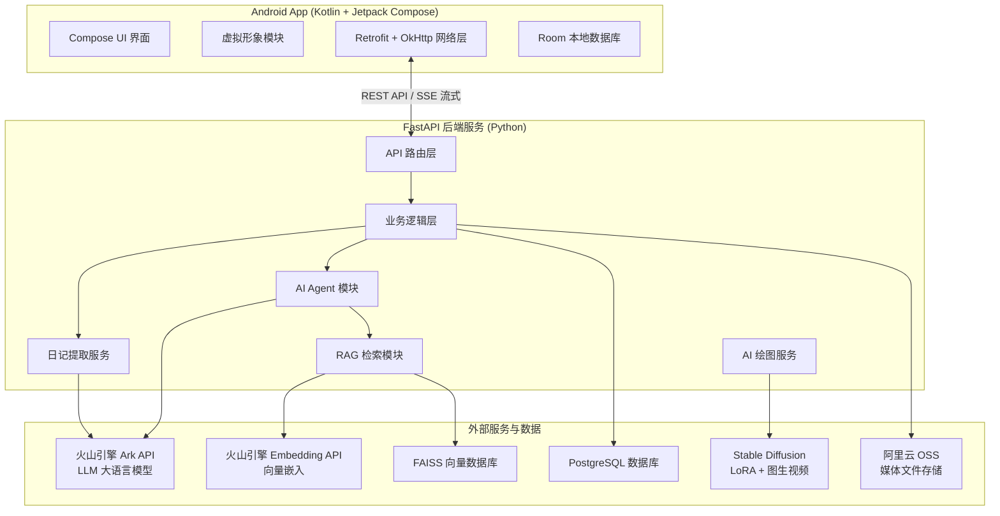
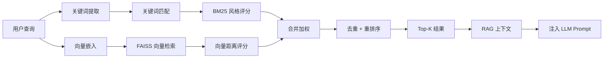
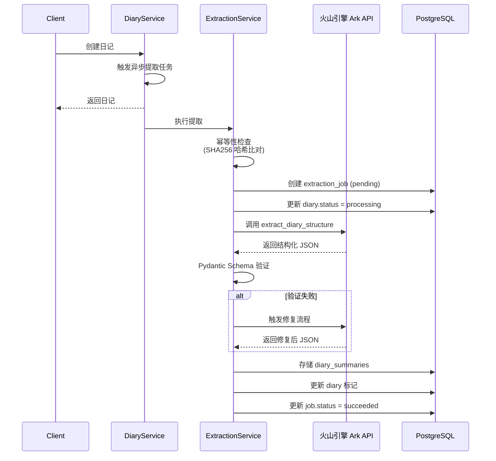

# 心语 - 智能日记系统 设计文档

**作品名称**：心语（Smart Diary）  
**所在赛道与赛项**：A-ST（软件测试与开发）

---

## 一、目标问题与意义价值

### 1.1 应用领域

心语是一款基于人工智能的智能日记应用，面向需要进行日常情绪记录、自我反思与个人成长的用户群体。系统以 Android 移动应用为主体，配合 Python FastAPI 后端服务，提供日记撰写、AI 辅助分析、情绪追踪、AI 对话交互、AI 绘图与视频生成等一体化功能。

### 1.2 解决的问题

传统的日记应用仅提供文字记录功能，存在以下痛点：

- **信息碎片化**：日记内容缺乏结构化整理，用户难以快速回顾和发现规律
- **情绪管理缺失**：缺少对情绪变化的追踪与分析工具
- **创作动力不足**：纯文字记录方式单一，用户持续使用率低
- **检索困难**：随着日记数量增长，关键词检索效率低下，无法实现语义关联查询
- **隐私与个性化矛盾**：通用 AI 模型无法理解用户的个人风格和表达习惯

心语系统通过以下方式解决上述问题：

| 问题 | 解决方案 |
|------|---------|
| 信息碎片化 | LLM 自动生成结构化摘要、关键词、话题分类 |
| 情绪管理缺失 | 8 维度情绪分析、高光时刻/小确幸标记、周期性情绪报告 |
| 创作动力不足 | AI Agent 对话式交互、虚拟形象陪伴、AI 文生图/图生视频 |
| 检索困难 | FAISS 向量检索 + RAG 上下文关联检索，支持语义检索日记 |
| 隐私与个性化矛盾 | LoRA 个性化绘图微调，基于用户历史日记的 RAG 上下文 |

### 1.3 目标与基本功能

系统实现以下核心功能：

1. **日记管理**：创建、编辑、删除日记，支持按日期查看日历视图
2. **多媒体支持**：文字、图片、音频、视频多种媒体形式，OSS 云端存储
3. **语音输入**：录音转文字，降低输入门槛
4. **AI 结构化提取**：自动生成摘要、关键词、情绪分析、高光时刻判定
5. **AI 对话助手**：基于日记上下文的流式对话，支持工具调用（创建日记、搜索日记、创建待办等），支持用户确认后再执行操作
6. **情绪追踪**：多维度情绪记录（8 种情绪类型 + 强度 + 分布）、周期性分析
7. **AI 绘图与视频生成**：文生图、图生视频、变换视频，支持日记配图自动生成
8. **虚拟形象交互**：两个虚拟角色，支持触碰交互和表情动画
9. **待办事项管理**：与日记关联的任务管理，支持 AI 创建
10. **白噪音与专注计时**：专注番茄钟模式，背景白噪音播放
11. **心理测试**：内置心理健康量表测试（PHQ-9、SDS 等），记录历史结果
12. **成就系统**：日记连续记录天数等成就激励

### 1.4 理论意义与应用价值

**理论意义**：
- 探索了大语言模型（LLM）在个人日记场景下的结构化信息提取应用，验证了内容哈希驱动的幂等性提取机制
- 实践了 RAG（检索增强生成）技术在私有日记数据上的语义检索增强方案，实现了向量检索与关键词检索的双路召回
- 验证了 AI Agent（工具调用型代理）在移动应用中的端云协同交互模式，通过用户确认机制保障数据安全

**应用价值**：
- 帮助用户建立持续记录习惯，提升自我认知与情绪管理能力
- 通过 AI 技术降低日记记录的心理门槛（语音输入、AI 辅助撰写，自然语言交互）
- 为心理健康辅助工具提供技术参考，具有向心理测评、情绪预警等方向扩展的潜力

---

## 二、设计思路与方案

### 2.1 总体架构设计

心语系统采用**前后端分离 + AI 增强**的架构模式，分为三个主要子系统：



### 2.2 技术路线

| 层次 | 技术选型 | 说明 |
|------|---------|------|
| **移动端** | Kotlin + Jetpack Compose | 现代声明式 UI |
| **移动端架构** | MVVM + Hilt DI | 依赖注入、生命周期管理 |
| **移动端网络** | Retrofit 2 + OkHttp | RESTful API + SSE 流式响应 |
| **移动端本地存储** | Room 数据库 | SQLite ORM，缓存日记数据 |
| **后端框架** | FastAPI (Python 3.x) | 高性能异步 API 框架 |
| **数据库** | PostgreSQL + SQLAlchemy (asyncpg) | 异步 ORM，支持 JSONB/ARRAY 类型 |
| **异步任务** | Celery + Redis | 后台提取任务队列 |
| **LLM 服务** | 火山引擎 Ark API | 豆包/Seed 系列大语言模型 |
| **向量检索** | FAISS | Facebook 开源向量索引库 |
| **图像生成** | Stable Diffusion v1.5 + Diffusers | 开源文生图模型 |
| **模型微调** | PEFT (LoRA) | 低秩适配器，风格定制 |
| **图生视频** | 模型推理服务 | 将静态图转换为动态视频 |
| **服务器** | Uvicorn | ASGI 异步服务器 |

### 2.3 详细设计方案

#### 2.3.1 日记数据模型设计

系统设计了 26 张数据库表，核心表结构如下：

| 表名 | 说明 | 关键字段 |
|------|------|---------|
| **users** | 用户表 | id, username, password_hash, nickname, avatar, phone, email, gender, birthday |
| **diaries** | 日记主表 | id, user_id, title, content, diary_date, weather, location, mood_score, **extraction_status, content_hash (SHA256), extract_version, embedding_status** |
| **diary_summaries** | 摘要表 | summary, keywords (TEXT[]), primary_emotion, emotion_score, emotion_intensity, emotion_distribution (JSONB), has_highlight, highlight_summary, people_mentioned (JSONB), places_mentioned (JSONB) |
| **diary_media** | 日记媒体块 | diary_id, asset_id, media_type (text/image/audio/video), content, sort_order |
| **extraction_jobs** | 提取任务记录 | diary_id, status, attempts, execution_time_ms, error_message, content_hash, extract_version |
| **todos** | 待办事项 | user_id, todo_date, title, note, is_done, sort_order |
| **chat_agent_plans** | Agent 待确认计划 | plan_id, tool, mode, requires_confirmation, arguments (JSONB), status, expires_at |
| **emotion_records** | 情绪记录 | user_id, emotion_type, emotion_score, recorded_at |
| **artworks** | 画作表 | user_id, prompt, image_url, lora_weight_path, video_url |
| **emotion_videos** | 情绪视频 | artwork_id, video_url, status, prompt |
| **pets** | 虚拟宠物 | user_id, pet_type, name |
| **pet_interactions** | 宠物互动记录 | pet_id, interaction_type, created_at |
| **media_uploads** | 本地上传媒体 | user_id, file_name, file_path, file_type, thumbnail_path |
| **media_files** | OSS 媒体文件 | diary_id, type, url, oss_bucket, oss_key, size_bytes, duration_ms |
| **voice_transcriptions** | 语音转文字 | diary_id, media_id, original_text, processed_text, confidence, detected_emotion |
| **test_types** | 测试类型 | type_key, name, description, questions_count |
| **test_questions** | 测试题目 | test_type_id, question_text, options (JSONB), scores (JSONB) |
| **user_test_records** | 用户测试记录 | user_id, test_type_id, total_score, result_interpretation, created_at |
| **user_test_answers** | 用户答案 | record_id, question_id, selected_option, score |
| **highlight_moments** | 高光时刻 | diary_id, summary |
| **small_happiness** | 小确幸 | diary_id, content |
| **period_summaries** | 周期性总结 | user_id, period_type, start_date, end_date, content |

#### 2.3.2 AI Agent 工具调用设计

Agent 模块采用**流式输出 + 工具调用 + 用户确认 + 客户端动作**的交互模式：

**工具类型**：

| 工具名称 | 类型 | 需要确认 | 功能 |
|---------|------|---------|------|
| create_diary | operation | 是 | 创建日记 |
| update_diary | operation | 是 | 编辑日记 |
| create_todo | operation | 是 | 创建待办 |
| search_diaries | read_only | 否 | 关键词搜索日记 |
| get_recent_summaries | read_only | 否 | 获取最近摘要 |
| open_white_noise | client_action | 否 | 通知客户端打开白噪音页面 |
| open_test_hub | client_action | 否 | 通知客户端打开测试中心 |
| open_drawing | client_action | 否 | 通知客户端打开绘图页面 |
| open_diary_editor | client_action | 否 | 通知客户端打开日记编辑器 |

**交互流程（SSE 流式）**：
1. 用户发送消息 → 后端通过 SSE 流式返回 AI 回复（`delta` 事件）
2. 若 AI 需要执行读操作 → 返回 `tool_status` → `tool_result` 事件 → 继续生成回复
3. 若 AI 需要执行写操作 → 返回 `tool_plan` 事件（含 plan_id 和操作预览）→ `awaiting_confirmation` 事件，暂停流式输出
4. 客户端展示操作预览卡片 → 用户可确认、取消或编辑参数
5. 用户确认 → 发送确认请求 → 后端执行工具 → 返回 `tool_result` → AI 生成后续回复
6. 若 AI 需要客户端跳转页面 → 返回 `client_action` 事件（action + payload）

**流式事件类型**：`start`、`delta`、`tool_status`、`tool_result`、`tool_plan`、`awaiting_confirmation`、`client_action`、`done`、`error`

#### 2.3.3 RAG 检索增强设计

RAG 模块采用**双路召回 + 去重重排序 + 结果缓存**策略：



1. **关键词提取**：中文 jieba 分词 + 英文 tokenize，提取 2-gram/3-gram n-gram
2. **向量检索**：火山引擎 Embedding API → FAISS.index_search()，top_k 检索
3. **关键词检索（Fallback）**：BM25 风格命中计数，支持 CJK 字符
4. **合并与重排序**：两路结果加权合并（原始查询权重 1.0，扩展查询 0.8），去重后按评分降序
5. **结果缓存**：最多缓存 100 条查询结果，避免重复检索

知识库文档自动从 `knowledge_base/` 等目录加载，支持 txt、json、md 等格式，按 500 字符分块，50 字符重叠。

#### 2.3.4 日记提取服务设计

日记提取服务采用**异步任务 + 幂等性检查 + Schema 验证与修复 + 错误重试**机制：



**情绪分析维度**：
- 主要情绪（8 种）：开心、平静、焦虑、愤怒、低落、兴奋、复杂、中性
- 情绪评分（1-100）：与情绪类型一致性校验（积极情绪 >= 56，消极 <= 45）
- 情绪强度：轻微、中等、强烈
- 情绪分布：各情绪类型占比（总和为 1.0）

#### 2.3.5 Stable Diffusion LoRA + 图生视频设计

**绘图模式**：

| 模式 | 说明 |
|------|------|
| 文生图 | 用户输入 prompt → SD 生成图片 |
| 草图增强 | 用户手绘草图 + prompt → SD 增强生成 |
| 日记配图 | 选择日记 → 自动提取摘要关键词 → SD 生成配图 |
| LoRA 个性化 | 用户上传 5-20 张风格图片 → 训练 LoRA → 用 LoRA 生成 |

**图生视频功能**：
- **常规视频生成**：输入图片 + 运镜描述 → 生成动态视频
- **变换视频生成**：输入图片 → 生成"画面动起来"的短视频

LoRA 训练配置：秩（rank）4-8，学习率 1e-4，PEFT LoraConfig 作用于 UNet 注意力层，支持 Accelerate 加速训练。

---

## 三、方案实现

### 3.1 Android 应用实现

#### 3.1.1 项目结构

```
app/
├── src/main/java/com/example/mydiary/
│   ├── MainActivity.kt                # 主活动，Hilt 注入入口
│   ├── DiaryApplication.kt           # Hilt Application 组件
│   ├── data/
│   │   ├── models/                   # 数据模型
│   │   │   ├── Models.kt            # 日记相关模型
│   │   │   ├── ChatModels.kt        # 对话相关模型（SSE 事件解析）
│   │   │   ├── DrawingModels.kt      # 绘图相关模型
│   │   │   ├── TestModels.kt        # 心理测试模型
│   │   │   ├── User.kt              # 用户模型
│   │   │   └── TodoModels.kt        # 待办模型
│   │   ├── network/
│   │   │   ├── DiaryApiService.kt   # Retrofit API 接口定义
│   │   │   ├── SafeApiCall.kt       # 安全 API 调用封装
│   │   │   ├── ApiEndpoints.kt      # API 端点常量
│   │   │   └── NetworkConfig.kt     # OkHttp 配置（SSE 超时）
│   │   ├── repository/              # 数据仓库层
│   │   │   ├── DiaryRepository.kt
│   │   │   ├── DrawingRepository.kt
│   │   │   ├── VoiceRepository.kt
│   │   │   ├── TestRepository.kt
│   │   │   ├── AchievementRepository.kt
│   │   │   ├── UserRepository.kt
│   │   │   └── TodoRepository.kt
│   │   └── local/
│   │       ├── ChatHistoryStorage.kt  # 对话历史本地持久化
│   │       ├── TestHistoryStorage.kt  # 测试历史本地存储
│   │       └── SessionManager.kt       # 登录会话管理
│   ├── ui/
│   │   ├── calendar/                 # 日历视图（月份网格 + 日记列表）
│   │   ├── chat/                    # AI 对话（流式 SSE + 工具计划卡片 + 客户端动作）
│   │   ├── editor/                  # 日记编辑器（富文本 + 情绪选择 + 附件）
│   │   ├── drawing/                 # AI 绘图（文生图 + 草图增强 + 视频生成）
│   │   ├── live2d/                  # 虚拟形象展示页
│   │   ├── test/                    # 心理测试（量表展示 + 答题 + 结果）
│   │   ├── todo/                    # 待办事项（创建 + 列表）
│   │   ├── achievement/              # 成就系统 + 商店
│   │   ├── timer/                   # 番茄钟专注计时
│   │   ├── search/                  # 日记全文检索
│   │   ├── whitenoise/              # 白噪音播放器
│   │   └── profile/                 # 个人中心 + 设置
│   ├── navigation/
│   │   └── NavGraph.kt             # Navigation Compose 导航图
│   ├── live2d/                     # 虚拟形象 SDK 封装
│   │   ├── Live2DManager.kt        # 核心管理类（模型加载/动画/触碰）
│   │   ├── Live2DView.kt          # GLSurfaceView 封装
│   │   ├── Live2DConfig.kt         # 虚拟形象配置（角色路径）
│   │   ├── Live2DHelper.kt         # JSON 解析/路径构建
│   │   ├── Live2DModelSelector.kt  # 角色切换
│   │   ├── TextureManager.kt       # 纹理管理
│   │   └── ModelConfig.kt          # 模型配置数据结构
│   └── di/
│       └── NetworkModule.kt         # Hilt 网络模块（Retrofit + OkHttp + Gson）
└── src/main/assets/
    └── live2d/                      # 虚拟形象模型资源
```

#### 3.1.2 核心界面实现

**日历视图（CalendarScreen）**：
- 月份日历网格，有日记的日期用圆点标记
- 底部日记卡片列表，展示当天日记预览（标题 + 情绪图标）
- FAB 悬浮按钮，弹出快速操作面板（创建日记 / 添加待办 / 搜索日记）

**AI 对话界面（ChatScreen + ChatViewModel）**：
- 流式文本输出（逐字显示，打字机效果）
- 图片上传支持（最多 3 张，base64 或 OSS URL）
- 语音输入（录音 → 上传后端转写 → 自动发送）
- **待确认工具计划卡片**：展示 AI 建议的操作名称、参数预览、确认/取消按钮；操作类工具需确认，只读工具自动执行
- **客户端动作处理**：监听 SSE `client_action` 事件，自动导航到对应页面

**日记编辑器（DiaryEditorScreen）**：
- 标题 + 正文输入框
- 情绪评分滑动条（1-100）+ 情绪类型选择
- 天气/位置标签选择
- 图片/语音附件上传
- 保存后自动触发后端提取任务（异步）

#### 3.1.3 虚拟形象实现

系统集成了 **Live2D Cubism SDK for Java (v5-r.4.1)**，实现了精细的虚拟角色交互：

**核心技术实现**：
- **模型加载**：解析 model3.json 配置文件，动态加载 .moc3 模型、.pose.json 姿态、.physics3.json 物理
- **渲染管线**：GLSurfaceView + CubismRendererAndroid，支持透明度混合
- **动画系统**：
  - 呼吸动画（ParamAngleX/Y/Z, ParamBodyAngleX, ParamBreath）
  - 眨眼系统（CubismEyeBlink）
  - 手势动作（CubismMotion，FadeIn/FadeOut 淡入淡出）
  - 表情动画（CubismExpressionMotion）
- **物理仿真**：CubismPhysics 驱动头发、衣服的物理晃动
- **触碰检测**：基于模型顶点的 HitArea 判定，触发对应动作和文本显示
- **透明度动画**：Part 部件淡入淡出，支持部件切换效果
- **平滑过渡**：Idle 状态下参数值以缓动函数回归默认值

### 3.2 后端服务实现

#### 3.2.1 项目结构

```
backend/
├── app/
│   ├── main.py                      # FastAPI 应用入口
│   ├── config.py                    # 环境变量配置（.env 管理）
│   ├── celery_app.py               # Celery 异步任务配置
│   ├── routers/                    # API 路由层
│   │   ├── diaries.py               # 日记 CRUD + 提取 + 摘要查询
│   │   ├── chat.py                 # 流式对话（/chat/ + /chat/stream）
│   │   ├── media.py                # 媒体上传与获取
│   │   ├── voice.py                # 语音转文字
│   │   ├── todos.py                # 待办事项 CRUD
│   │   ├── diary_search.py          # 日记全文搜索
│   │   ├── diary_summaries.py       # 摘要查询
│   │   └── users.py                # 用户管理
│   ├── services/                    # 业务逻辑层
│   │   ├── diary_service.py         # 日记 CRUD、幂等性触发提取/向量化
│   │   ├── extraction_service.py   # 提取服务（LLM 调用、Schema 验证修复）
│   │   ├── diary_embedding_service.py  # 向量化服务（Embedding → FAISS）
│   │   ├── voice_service.py        # 语音处理
│   │   ├── media_service.py        # 媒体文件服务
│   │   ├── todo_service.py         # 待办服务
│   │   ├── doubao_embedding_service.py  # 火山引擎 Embedding 封装
│   │   ├── external_api_client.py   # LLM API 统一客户端
│   │   └── rag/                    # RAG 检索模块
│   │       ├── retriever.py         # 检索器（向量+关键词双路）
│   │       ├── embedding_service.py  # Embedding 包装
│   │       ├── faiss_store.py       # FAISS 索引管理
│   │       ├── document_loader.py   # 文档加载与分块
│   │       └── keyword_extractor.py  # 中英关键词提取
│   │   └── drawing/                # AI 绘图服务
│   ├── agent/                      # AI Agent 模块
│   │   ├── tools.py               # 工具注册表（9 个工具 + 执行器）
│   │   └── plan_store.py          # 待确认计划存储（PostgreSQL）
│   ├── models/
│   │   ├── database.py             # SQLAlchemy ORM（26 张表）
│   │   └── schemas.py              # Pydantic 请求/响应模型
│   └── utils/
│       └── error_handler.py        # 统一错误处理
├── migrations/                     # Alembic 数据库迁移
├── uploads/                        # 本地上传文件存储
├── requirements.txt                 # Python 依赖
└── .env.example                   # 环境变量示例
```

#### 3.2.2 核心 API 端点

**日记接口（`/api/diaries/`）**：

| 方法 | 路径 | 说明 |
|------|------|------|
| POST | `/api/diaries/` | 创建日记（自动触发异步提取） |
| GET | `/api/diaries/{date}` | 按日期获取日记（最新一条） |
| GET | `/api/diaries/{date}/all` | 按日期获取所有日记 |
| GET | `/api/diaries/id/{diary_id}` | 按 ID 获取日记 |
| GET | `/api/diaries/id/{diary_id}/detail` | 按 ID 获取日记（含聚合媒体列表） |
| PUT | `/api/diaries/{diary_id}` | 更新日记（内容变化则重新触发提取） |
| DELETE | `/api/diaries/{diary_id}` | 删除日记（级联删除 + 清理 FAISS 向量） |
| GET | `/api/diaries/dates-with-diary` | 获取有日记的日期列表（年份+月份） |
| PUT | `/api/diaries/{diary_id}/media` | 批量同步媒体项（全量同步） |
| POST | `/api/diaries/{diary_id}/extract` | 手动触发提取任务 |
| GET | `/api/diaries/{diary_id}/extract/status` | 查询提取任务状态 |
| GET | `/api/diaries/{diary_id}/summary` | 获取单个日记摘要 |
| GET | `/api/diaries/summaries` | 查询多个日记摘要（支持日期/关键词/情绪过滤） |
| GET | `/api/diaries/summaries/export` | 导出摘要文件（JSON/Markdown） |
| GET | `/api/diaries/highlights` | 获取高光时刻日记列表 |
| GET | `/api/diaries/little-joys` | 获取小确幸日记列表 |
| GET | `/api/diaries/search` | 日记全文检索（标题+正文+媒体文本） |

**对话接口（`/api/chat/`）**：

| 方法 | 路径 | 说明 |
|------|------|------|
| POST | `/api/chat/` | 普通对话（非流式） |
| POST | `/api/chat/stream` | 流式对话（SSE，含工具调用） |

**媒体接口（`/api/media/`）**：

| 方法 | 路径 | 说明 |
|------|------|------|
| POST | `/api/media/upload` | 上传媒体文件（返回 OSS URL 或本地路径） |
| GET | `/api/media/{file_id}` | 获取媒体文件 |

#### 3.2.3 提取服务实现细节

`extraction_service.py` 核心流程（10 步）：

```python
async def extract_diary(diary_id: int, force: bool = False):
    # 1. 查询日记及关联数据（media_items + voice_transcriptions）
    # 2. 幂等性检查：计算 SHA256(content + title + media_texts + transcriptions)
    #    比对 diary.content_hash，相同则跳过
    # 3. 创建 ExtractionJob 记录（pending）
    # 4. 更新 diary.extraction_status = "processing"
    # 5. 收集日记内容（标题 / 正文 / 媒体文本 / 语音转录）
    # 6. 调用火山引擎 Ark API（extract_diary_structure 方法）
    # 7. Pydantic Schema 验证，失败则调用 LLM 修复（最多 1 次）
    #    修复仍失败 → 使用默认提取结果（中性情绪、关键词"日记"）
    # 8. 存储结果到 diary_summaries 表
    # 9. 更新 diary 标记：is_extracted=1, is_highlight, is_little_joy
    # 10. 更新 ExtractionJob 状态为 succeeded
```

#### 3.2.4 RAG 检索实现细节

`retriever.py` 核心检索逻辑（6 步）：

```python
async def retrieve(query: str, top_k: int = 5, use_keywords: bool = True):
    # 1. 缓存命中检查（最多 100 条缓存）
    # 2. 确保知识库已加载（首次调用时从 docs/ 目录加载并建索引）
    # 3. 关键词提取：中文 jieba 分词 + CJK n-gram (2/3)
    # 4a. 向量检索：embedding → FAISS.search()
    # 4b. 关键词检索（Fallback）：BM25 风格命中计数
    # 5. 合并两路结果（原始查询权重 1.0，扩展查询 0.8），去重
    # 6. 缓存结果 → 返回 Top-K
```

### 3.3 AI 绘图与视频模块实现

```
stablediffusion/
├── train_lora.py                    # LoRA 训练脚本（Accelerate + PEFT）
├── inference.py                     # 文生图推理脚本
├── config.py                        # 配置（模型路径、LoRA 参数）
├── data/
│   ├── images/                     # 训练图片目录
│   │   ├── style1/                # 风格1图片
│   │   └── style2/                # 风格2图片
│   └── captions/                  # 图片描述文件（可选）
│       ├── style1/
│       └── style2/
└── output/                         # 输出目录（LoRA 权重、生成图片）
```

后端 `drawing/` 服务提供：
- 文生图 API（SD v1.5 + LoRA 权重挂载）
- 草图增强 API（ControlNet 或 Img2Img）
- 图生视频 API（模型推理服务轮询）

### 3.4 软件测试与质量保障

作为 A-ST（软件测试与开发）赛道的参赛作品，系统在设计与实现阶段充分考虑了软件质量保障：

**后端接口测试**：
- FastAPI 基于 Pydantic 的请求/响应模型自动校验数据类型、必填字段、取值范围
- 统一的错误处理封装（`error_handler.py`），所有 API 返回一致的错误格式
- 日记 ID 和 user_id 的双重校验，防止越权访问

**数据一致性保障**：
- 数据库事务：日记删除时自动级联删除关联的 `diary_media`、`voice_transcriptions`、`extraction_jobs` 等记录
- FAISS 向量清理：删除日记时同步从 FAISS 索引中移除对应向量
- `media_uploads` 孤立文件清理：删除日记时检查并清理不再被引用的上传文件

**LLM 输出可靠性**：
- Pydantic Schema 严格验证 LLM 返回的 JSON 结构，不符合则触发修复流程
- 修复仍失败时降级为安全默认结果，保障系统可用性
- SHA256 内容哈希驱动的幂等性机制，避免重复提取浪费 API 调用

**异步任务可靠性**：
- Celery + Redis 任务队列确保提取任务不丢失
- ExtractionJob 记录每次执行的完整状态（pending/processing/succeeded/failed）、重试次数、执行时间

**本地存储可靠性**：
- 对话历史存储采用 JSON 文件持久化，App 重启后可恢复
- 测试历史本地缓存，支持离线查看

---

## 四、运行结果与应用效果

### 4.1 系统整体运行情况

**\[图1\]\[请用户提供：APP 首页/日历视图截图，描述：展示日历网格、有日记日期的圆点标记、底部日记列表、底部导航栏（日历/对话/发现/我的）\]**

**\[图2\]\[请用户提供：日记编辑/创建界面截图，描述：展示标题输入框、正文编辑器、情绪评分滑动条、情绪类型选择、天气标签\]**

### 4.2 AI 对话与 Agent 交互

**\[图3\]\[请用户提供：AI 对话界面截图，描述：展示流式输出的 AI 回复（打字机效果）、一个待确认的操作卡片（如"创建日记"，含确认/取消按钮）\]**

系统支持：
- 自然语言对话，可询问"我这周情绪怎么样？"、"帮我搜索关于旅行的日记"
- AI 自动调用 `get_recent_summaries` / `search_diaries` 等工具获取上下文
- 工具执行结果注入上下文，生成个性化回复
- 操作类工具（create_diary、create_todo、update_diary）需用户确认后才执行
- 用户可通过对话自然地完成日记创建、待办添加等操作

### 4.3 日记结构化提取与情绪追踪

**\[图4\]\[请用户提供：日记摘要/情绪分析展示截图，描述：展示 LLM 提取的摘要文字、关键词标签、情绪评分（圆形进度条）、情绪类型（开心/平静等）、高光时刻勾选标记\]**

自动提取结果包括：
- 50-200 字摘要
- 3-10 个关键词标签
- 1-10 个主要话题
- 8 维度情绪分布（柱状图或饼图）+ 主要情绪类型 + 评分
- 高光时刻/小确幸智能判定

### 4.4 AI 绘图与视频生成

**\[图5\]\[请用户提供：AI 绘图功能截图，描述：展示绘图界面——Prompt 输入框、风格选择（水彩/油画等）、生成按钮、"图生视频"入口，以及生成的图片展示\]**

用户可：
- 输入 prompt 生成图片
- 上传手绘草图并描述想要的风格
- 选择已有日记自动生成配图
- 上传 5-20 张风格参考图训练个人 LoRA
- 对生成的图片一键生成动态视频

### 4.5 虚拟形象交互

**\[图6\]\[请用户提供：虚拟形象交互截图，描述：展示虚拟角色的正面图，以及一个触碰气泡提示\]**

两个虚拟角色均有专属触碰动作和对话，通过 OpenGL 渲染实现流畅的呼吸动画、表情变化、物理仿真效果。

### 4.6 心理测试与专注计时

**\[图7\]\[请用户提供：心理测试或专注计时功能截图，描述：展示测试量表题目和选项，或番茄钟计时界面\]**

### 4.7 后端服务状态

**\[图8\]\[请用户提供：后端 API 文档/Swagger UI 截图，描述：展示 Swagger 界面，列出各 API 端点\]**

系统已在服务器上部署运行，后端服务稳定响应。

---

## 五、创新与特色

### 5.1 AI Agent 端云协同交互模式

系统创新性地将 AI Agent 工具调用能力引入移动日记应用。用户可以通过自然语言与 AI 助手交互，AI 自动理解意图后调用后端工具（创建日记、搜索日记、创建待办等），并在执行关键写操作前展示计划预览供用户确认。相比传统的表单式交互，该模式大幅降低了操作门槛，实现了"所说即所得"。

技术亮点：采用 SSE 流式响应保证实时性；操作类工具强制用户确认保障数据安全；读操作自动执行提高效率；客户端动作机制实现端云深度协同。

### 5.2 私有日记数据的 RAG 检索增强

系统针对用户私有日记数据构建了专属 RAG 知识库。采用 FAISS 向量检索 + 关键词提取双路召回策略，结合火山引擎 Embedding API 实现语义检索。当用户通过 AI 对话询问过往日记相关内容时，系统自动检索相关日记片段作为上下文注入 LLM，解决了纯参数化上下文窗口的容量限制问题。

技术亮点：知识库按需自动加载；中英文混合检索支持；向量检索与关键词检索加权融合；查询结果缓存机制。

### 5.3 日记结构化提取与幂等性保障

系统创新地将 LLM 的结构化信息提取能力应用于日记场景。在用户撰写日记后，自动异步生成摘要、关键词、话题分类、8 维度情绪分析，并智能判定是否为"高光时刻"或"小确幸"。通过 SHA256 内容哈希实现幂等性保障——日记内容未变化时不重复提取，节省 API 调用成本。

技术亮点：Pydantic Schema 严格验证 LLM 输出；验证失败自动触发 LLM 修复流程；修复仍失败时降级为默认安全结果；提取状态和版本号支持灰度升级。

### 5.4 Stable Diffusion LoRA 个性化绘图与图生视频

用户可上传少量（5-20 张）个人风格的参考图片，系统自动训练一个轻量级 LoRA 模型。用户只需输入日记内容或关键词，即可生成符合个人风格的配图。在此基础上，系统还支持"图生视频"功能，将静态配图转换为动态短视频，大幅提升了日记的可视化表现力。

技术亮点：小样本 LoRA 训练（5-20 张图即可）；双风格触发词支持（STYLE1/STYLE2）；PEFT 低秩适配，显存需求低；图生视频轮询任务状态，支持变换视频生成。

### 5.5 虚拟形象精细化交互

系统在 Android 端集成了 Live2D Cubism SDK 5，实现了两个虚拟角色的精细化交互。虚拟形象通过 OpenGL 实时渲染，支持呼吸动画、眨眼系统、物理仿真、手势动作、表情动画等多种动画效果。用户触碰不同部位可触发专属对话和动作，通过缓动函数实现 Idle 状态到动作状态的平滑过渡。

技术亮点：基于顶点 HitArea 的精确触碰检测；多部件透明度动画；CubismPhysics 物理驱动；动作 FadeIn/FadeOut 淡入淡出；GL 上下文生命周期精细管理。

---

## 附注

- 本文档中所有涉及的个人信息均为虚构或脱敏处理，符合作品匿名要求。
- 系统架构图和数据流图基于源代码分析绘制，如有出入以实际代码为准。
- 外部服务（火山引擎 Ark API、阿里云 OSS）的具体配置参数通过环境变量管理，不在文档中披露。
