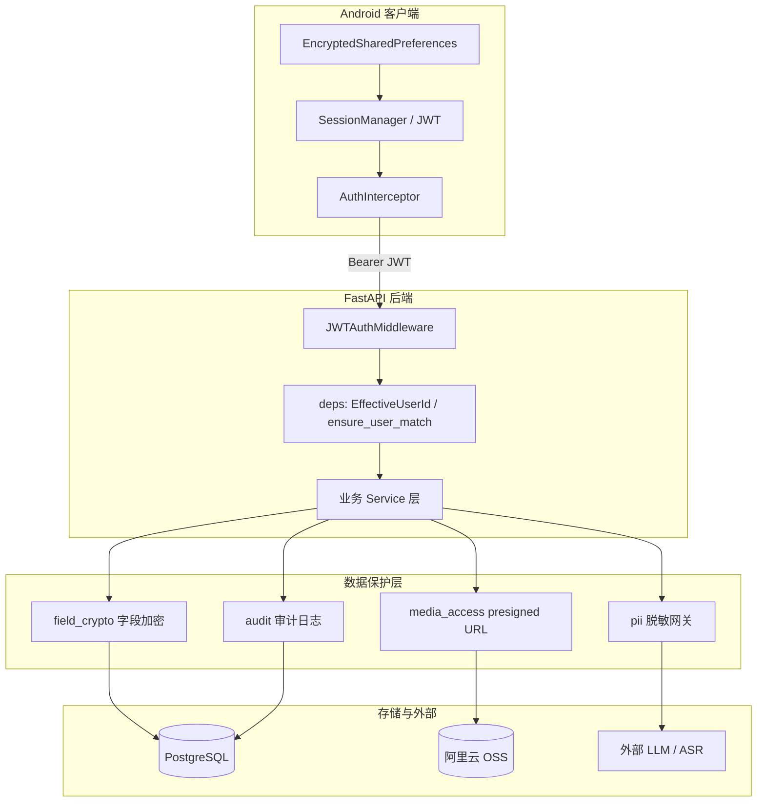

# 心语日记（MoodDairy）隐私与安全保护实现说明

> 文档描述**当前代码库已落地**的隐私与安全能力，便于开发、部署与竞赛答辩引用。  
> 最后更新：2026-06-09  
> 相关代码目录：`backend/app/security/`、`app/src/main/java/.../data/local/`、`app/src/main/java/.../di/`

---

## 1. 设计目标

心语日记处理用户的情感日记、语音、图片等多模态私域数据。安全体系围绕以下目标构建：

| 目标 | 说明 |
|------|------|
| **身份可信** | 只有登录用户能访问 API；不能冒充他人读写数据 |
| **存储可防窥** | 数据库泄露时，日记正文不应以明文直接可读 |
| **出站最小化** | 发往外部 LLM/云 API 的文本尽量去除 PII |
| **媒体可控访问** | OSS 对象通过限时链接访问，降低链接扩散风险 |
| **行为可追溯** | 关键操作写入审计表，便于排查与答辩演示 |
| **端侧凭证保护** | JWT 与用户信息不以明文存于 SharedPreferences |

**当前未强制项**：全站 HTTPS 重定向（开发/演示阶段保留 HTTP，生产部署建议由 Nginx/网关补齐）。

---

## 2. 整体架构



**请求主路径**：Android 携带 JWT → 中间件校验 → 路由层绑定当前用户 ID → 业务层读写数据 → 响应前解密/签名 URL。

---

## 3. 身份认证与访问控制

### 3.1 密码存储（bcrypt）

**模块**：`backend/app/security/password.py`、`backend/app/services/user_service.py`

- 新注册用户密码使用 **bcrypt** 哈希后写入 `users.password`
- 登录时用 `verify_password` 校验
- **兼容旧数据**：若库中仍是历史明文密码，验证通过后会在登录时自动 **rehash** 为 bcrypt

```python
# password.py 核心逻辑
# - 以 $2 开头视为 bcrypt 哈希
# - 否则按明文比对（遗留兼容）
# - needs_rehash() 触发升级
```

### 3.2 JWT 访问令牌

**模块**：`backend/app/security/jwt_auth.py`

| 项目 | 说明 |
|------|------|
| 算法 | HS256（可通过 `JWT_ALGORITHM` 配置） |
| 载荷 | `sub`（用户 ID）、`username`、`exp`、`iat` |
| 有效期 | 默认 **168 小时（7 天）**，环境变量 `JWT_EXPIRE_HOURS` |
| 密钥 | `JWT_SECRET`（**必须在生产 `.env` 中配置随机长字符串**） |

登录 `/api/users/login`、注册 `/api/users/register` 成功后返回 `AuthResponse`，包含 `access_token` 字段。

### 3.3 全局 JWT 中间件

**模块**：`backend/app/security/middleware.py`  
**挂载**：`backend/app/main.py` → `app.add_middleware(JWTAuthMiddleware)`

**公开路径（无需 Token）**：

| 路径 | 用途 |
|------|------|
| `/`、`/health` | 健康检查 |
| `/docs`、`/openapi.json`、`/redoc` | API 文档 |
| `/api/users/login`、`/api/users/register` | 认证入口 |
| `/media/*`、`/uploads/*` | 本地静态媒体文件 |

其余所有 API（日记、聊天、媒体上传、语音、绘图、待办等）**必须**携带：

```http
Authorization: Bearer <access_token>
```

缺失或无效时返回 **401**，响应头含 `WWW-Authenticate: Bearer`。

### 3.4 路由级授权与 IDOR 防护

**模块**：`backend/app/security/deps.py`

提供三类依赖注入：

| 依赖 | 作用 |
|------|------|
| `AuthenticatedUserId` | 从 JWT 解析当前用户 ID，未登录抛 401 |
| `EffectiveUserId` | 允许 URL/Query 传 `user_id`，但**必须与 token 一致**，否则 403 |
| `ensure_user_match(a, b)` | 资源归属校验（如日记 `user_id` 必须等于当前用户） |

**已接入的主要路由**：

- `users.py`：查询/更新资料、头像 — `ensure_user_match`
- `diaries.py`：创建强制 token user_id；按 ID 读/改/删/同步媒体 — 归属校验
- `chat.py`：聊天请求体 `user_id` 与 token 一致
- `media.py`：上传前校验日记 owner
- `voice.py`：语音处理前校验日记 owner 与表单 `user_id`
- `todos.py`、`diary_search.py`、`diary_summaries.py`：`EffectiveUserId`

**典型攻击场景防护**：

```text
攻击者持有用户 A 的 token，却请求 user_id=B 的日记
→ EffectiveUserId / ensure_user_match → 403 无权访问
```

### 3.5 Android 端认证链路

| 组件 | 文件 | 说明 |
|------|------|------|
| 会话存储 | `SessionManager.kt` | 登录成功后保存用户信息与 `access_token` |
| 加密存储 | `SecurePreferences.kt` | 基于 `EncryptedSharedPreferences` + AES256 |
| 网络拦截 | `AuthInterceptor.kt` | 每个请求自动附加 `Authorization: Bearer` |
| 依赖注入 | `NetworkModule.kt` | 短/长超时 OkHttpClient 均注册 AuthInterceptor |
| 仓库层 | `UserRepository.kt` | 登录/注册解析 `accessToken` 并写入 Session |

**依赖**：`androidx.security:security-crypto:1.1.0-alpha06`

**升级注意**：Prefs 名称改为 `diary_session_secure`，旧版明文 SharedPreferences 会话**不兼容**，需重新登录。

---

## 4. 数据存储保护

### 4.1 日记字段级加密（Fernet）

**模块**：`backend/app/security/field_crypto.py`  
**调用**：`backend/app/services/diary_service.py`（创建/更新/读取）  
**提取链路**：`backend/app/services/extraction_service.py`（提取前解密）

| 项目 | 说明 |
|------|------|
| 算法 | Fernet（对称加密，底层 AES-128-CBC + HMAC） |
| 加密字段 | 日记 `title`、`content` |
| 存储格式 | 明文前缀 `enc:v1:` + Base64 密文 |
| 开关 | `FIELD_ENCRYPTION_ENABLED`（默认 `1` 开启） |
| 密钥 | `FIELD_ENCRYPTION_KEY`；留空时从 `JWT_SECRET` 派生 |

**读写行为**：

- **写入/更新**：`encrypt_field()` → 数据库存密文
- **读取 API**：`decrypt_diary_fields()` → 客户端仍看到明文
- **未加密历史数据**：无 `enc:v1:` 前缀则原样返回，**向后兼容**
- **密钥错误**：解密失败返回占位符 `[decryption_failed]`

**生成独立密钥**：

```bash
python -c "from cryptography.fernet import Fernet; print(Fernet.generate_key().decode())"
```

写入 `backend/.env` 的 `FIELD_ENCRYPTION_KEY=`。**密钥一旦用于生产数据，不可随意更换**。

### 4.2 数据库中的其他敏感数据

| 数据 | 当前保护 |
|------|----------|
| 用户密码 | bcrypt 哈希 |
| 用户手机/邮箱 | 明文存库（API 需 JWT；未单独字段加密） |
| 语音转录/摘要 | 明文存库，访问受 JWT + 日记归属约束 |
| 聊天本地历史 | Android `ChatHistoryStorage` 使用 EncryptedSharedPreferences |

---

## 5. 出站隐私：LLM / 外部 API 脱敏

**模块**：`backend/app/security/pii.py`  
**调用**：`backend/app/routers/chat.py`（流式/非流式聊天、上下文组装）

### 5.1 脱敏规则

| 模式 | 替换为 |
|------|--------|
| 中国大陆手机号 `1[3-9]########` | `[PHONE]` |
| 电子邮箱 | `[EMAIL]` |
| 身份证号（18 位及带日期格式） | `[ID_CARD]` |
| 中文姓名 + 「说/表示/告诉…」等动词前 | `[PERSON]` |

`sanitize_for_llm()` 在脱敏后还会 **截断至 12000 字符**，防止超长上下文泄露或超 token。

### 5.2 覆盖范围

- 发往 LLM 的 **用户消息**、**历史 messages**、**RAG/日记上下文**
- **不覆盖**：用户写入数据库的原始日记（仍完整保存，仅出站 LLM 前脱敏）

---

## 6. 媒体访问安全

**模块**：`backend/app/security/media_access.py`、`backend/app/services/oss_service.py`

### 6.1 Presigned 临时 URL

当 `OSS_ENABLED=true` 且 `OSS_USE_PRESIGNED_URLS=1` 时：

- API 返回媒体 URL 前调用 `resolve_media_url()`
- 对 OSS 对象生成 **带签名的 GET URL**，默认有效期 `OSS_PRESIGN_EXPIRE_SECONDS=3600`（1 小时）
- 本地路径（`/media/...`、`uploads/...`）原样返回

**已接入的响应**：

- 日记列表/详情中的 `media_items`
- 日记详情聚合媒体 `media_items_aggregated`
- 媒体上传接口 `MediaUploadResponse.media_url`
- 媒体同步接口返回的 `MediaItemResponse`

### 6.2 上传权限

`POST /media/upload` 要求 JWT，且 `diary_id` 对应日记的 `user_id` 必须与 token 用户一致。

### 6.3 本地静态目录说明

`/media/`、`/uploads/` 在中间件中为**公开路径**（无需 JWT），用于本地存储模式下的文件访问。生产环境若仅用 OSS + presigned，应限制或关闭不必要的静态暴露。

---

## 7. Agent 安全执行（聊天写操作确认）

**模块**：`backend/app/routers/chat.py`、`backend/app/agent/tools.py`

部分 Agent 工具（如写日记、改待办）标记 `requires_confirmation=True`。执行流程：

1. LLM 提出工具调用 → 后端生成 **待确认计划**（plan）
2. 向客户端推送 `awaiting_confirmation` 事件
3. 用户在前端 **批准/拒绝/编辑参数** 后，携带 `confirmation` 字段再次请求 `/chat/stream`
4. 仅在用户批准后才真正执行写库操作

这与「无确认自动写库」形成对比，可作为竞赛 **Agent 安全执行网络** 的演示点。  
（该流程依赖 JWT 已认证用户，并与 `user_id` 绑定。）

---

## 8. 审计与日志安全

### 8.1 安全审计表

**表名**：`security_audit_logs`  
**迁移脚本**：`backend/migrations/004_security_audit_logs.sql`  
**ORM**：`backend/app/models/database.py` → `SecurityAuditLog`  
**写入模块**：`backend/app/security/audit.py` → `write_audit_log()`

| 字段 | 说明 |
|------|------|
| `user_id` | 操作用户（失败登录可为 NULL） |
| `action` | 如 `login`、`register`、`profile.update`、`diary.create` |
| `resource_type` | 如 `user`、`diary` |
| `resource_id` | 资源 ID 字符串 |
| `result` | `success` / `failure` |
| `ip_address` | 来自 `X-Forwarded-For` 或直连 IP |
| `detail` | 补充信息（如失败登录的用户名） |

**当前已记录的操作**：

| action | 触发位置 |
|--------|----------|
| `login` | 成功/失败登录 |
| `register` | 注册成功 |
| `profile.update` | 更新用户资料 |
| `diary.create` | 创建日记 |
| `diary.update` | 更新日记 |
| `diary.delete` | 删除日记 |

### 8.2 应用日志脱敏

**模块**：`backend/app/security/log_filter.py`  
**安装**：`main.py` → `install_sensitive_log_filter()`

对 root、`uvicorn`、`uvicorn.access`、`sqlalchemy.engine` 日志过滤：

- `password=...` → `password=***`
- `Bearer <token>` → `Bearer ***`
- 手机号 → `[PHONE]`

---

## 9. 环境变量配置参考

配置模板见 `backend/.env.example` 的 **Security** 段。生产环境在 `backend/.env` 中设置（**勿提交 Git**）。

| 变量 | 必填 | 说明 |
|------|------|------|
| `JWT_SECRET` | **是** | JWT 签名密钥，随机长字符串 |
| `JWT_EXPIRE_HOURS` | 否 | Token 有效期（小时），默认 168 |
| `FIELD_ENCRYPTION_KEY` | 建议 | Fernet 密钥；留空则从 JWT_SECRET 派生 |
| `FIELD_ENCRYPTION_ENABLED` | 否 | `1` 开启字段加密（默认） |
| `OSS_USE_PRESIGNED_URLS` | 否 | `1` 返回 presigned URL |
| `OSS_PRESIGN_EXPIRE_SECONDS` | 否 | presigned 有效期，默认 3600 |

> 注意：`.env.example` 中的 `JWT_EXPIRE_DAYS` 仅为说明性字段，**代码实际读取 `JWT_EXPIRE_HOURS`**。

### Python 依赖（`backend/requirements.txt`）

```
passlib[bcrypt]==1.7.4
bcrypt==4.1.2
PyJWT==2.8.0
cryptography==42.0.5
```

---

## 10. 部署与验证清单

1. `pip install -r backend/requirements.txt`
2. 在 PostgreSQL 执行 `backend/migrations/004_security_audit_logs.sql`
3. 配置 `backend/.env` 中 `JWT_SECRET`（及建议的 `FIELD_ENCRYPTION_KEY`）
4. 重启后端服务
5. Android 重新登录以获取 JWT
6. 验证项：
   - 无 Token 访问 `/diaries/` → 401
   - 错误 `user_id` 查询 → 403
   - 登录后创建日记 → DB 中 `content` 含 `enc:v1:`（启用加密时）
   - `SELECT * FROM security_audit_logs ORDER BY id DESC LIMIT 10` 有记录

---

## 11. 已知限制与后续可改进项

| 项 | 现状 | 建议 |
|----|------|------|
| HTTPS | 未在应用层强制 | 生产由 Nginx/负载均衡开启 TLS |
| 历史日记 | 加密启用前数据仍为明文 | 可选批量迁移脚本 |
| 用户手机/邮箱 | 库内明文 | 可选字段加密或列级 PG 加密 |
| 本地 `/media/` 静态路径 | 中间件免 JWT | 生产可改为仅 presigned/OSS |
| PII 脱敏 | 基于正则，非 NLP 实体识别 | 可接入专用 NER 提升准确率 |
| 审计覆盖 | 未覆盖全部接口（如聊天、媒体上传） | 按需扩展 `write_audit_log` |
| 密钥轮换 | 无自动化流程 | 需运维规程与数据重加密方案 |
| Token 刷新 | 无 refresh token | 过期需重新登录 |

---

## 12. 代码索引（快速定位）

```
backend/app/security/
├── password.py       # bcrypt 密码
├── jwt_auth.py       # JWT 签发/校验
├── middleware.py     # 全局 JWT 中间件
├── deps.py           # FastAPI 授权依赖
├── field_crypto.py   # 日记字段 Fernet 加密
├── pii.py            # LLM 出站 PII 脱敏
├── media_access.py   # OSS presigned URL 解析
├── audit.py          # 审计日志写入
└── log_filter.py     # 日志敏感信息过滤

backend/app/routers/
├── users.py          # 登录/注册 + 用户 API 授权
├── diaries.py        # 日记 CRUD + 审计 + 媒体 URL
├── chat.py           # 聊天授权 + PII 脱敏 + Agent 确认
├── media.py          # 上传归属校验
└── voice.py          # 语音处理归属校验

app/src/main/java/com/example/mydiary/
├── data/local/SecurePreferences.kt
├── data/local/SessionManager.kt
├── data/local/ChatHistoryStorage.kt
├── di/AuthInterceptor.kt
└── di/NetworkModule.kt
```

---

## 13. 与竞赛文档的关系

- 参赛总规划：`docs/competition/C4网络技术挑战赛2026_普通A类参赛规划.md`
- 亮点 1 简要落地清单：`docs/competition/亮点1_隐私保护落地说明.md`
- **本文档**：面向开发与答辩的**完整实现说明**，以当前代码为准。
